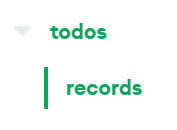
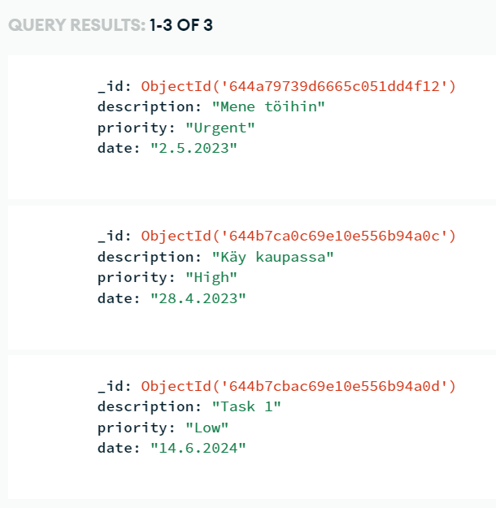

  <h1>To Do List MERN-seminaari</h1>
  
Kurssin Ohjelmistokehityksen teknologioita -seminaarityö

  <a href="https://github.com/laurireis/mern-seminaari">Projektin repositorio</a>  
  <a href="https://youtu.be/sxl1i0_e2ys">Sovelluksen esittelyvideo</a>

## Johdanto
Tässä seminaarityössä kokeilin ensimmäistä kertaa MERN-stackin hyödyntämistä. Sovelluksessa on yksinkertainen MongoDB backend ja React frontend. Seminaarityössä ei syvennytä pintaa syvemmälle, vaan tarkoitus oli tutustua kyseiseen arkkitehtuuriin.

[Seminaari perustuu pitkälti MongoDB:n omaan tutoriaaliin][mern-tutorial-url]

## Käytetyt tekniikat
- [![MongoDB][mongo-db]][mongo-db-url]
- [![Express][express]][express-url]
- [![Vite][vite]][vite-url]
- [![Node.js][nodejs]][nodejs-url]

### Vite
Halusin kokeilla Viteä omasta mielenkiinnostani perinteisen `create-react-app`:in sijaan. Kirjoitin Vite-koodini TypeScriptillä.

Vite on kuin perinteistä Reactia, mutta sitä on kehitelty. Oikea hyöty tulisi vastaan suuremman skaalan sovelluksissa, mutta tässä pienessä sovelluksessa huomattavin etu oli salamannopea kehitysympäristön käynnistys. Lisää Viten hyötyjä voi lukea [täältä](https://vitejs.dev/guide/why.html).

## Arkkitehtuurikaavio

(Lähde: [mongodb.com][mern-tutorial-url])

### Tietokannan rakenne

## Yhteenveto
Projektia oli mukava tehdä. Opin käyttämään yksinkertaisesti itselleni kokonaan uutta arkkitehtuuria.

Alussa oli paljon hankaluuksia. Vaikka projekti ei näytä siltä, että siihen olisi kulunut 20 tuntia, sen verran kyllä kului ja hieman enemmänkin. MongoDB:n käyttöönotto alkuunsa oli hankalaa. [MERN-tutoriaalissa][mern-tutorial-url] ei itsessään kerrottu kuinka MongoDB:tä käytetään, tutoriaalissa keskityttiin koodipuoleen ja kuinka dataa lähetetään tietokantaan. Tutoriaalissa oli pieni linkki kuinka tietokantaklusteri luodaan ja suoraan sanottuna se tutoriaali oli aika huono. Suuri osa tunneista meni klusteria luodessa ja yrittäessä saada yhteyttä siihen. MongoDB vaatii oman IP-osoitteen lisäämisen whitelistalle, jotta klusteriin yhdistäminen onnistuu. Jostain syystä Hoas-nettini joka päivä vaihtoi IP-osoitetta, joten luonnollisesti yhdistäminen ei onnistunut, koska osoitetta ei ollut whitelistattu. Lopulta kun tajusin tuon olleen ikuinen ongelmani, sovelluksen tekeminen loppuun oli jokseenkin helppoa.

Näistä kommelluksista huolimatta projekti muuten sujui hyvin. MongoDB vaikuttaa kohtuullisen aloittajaystävälliseltä (olettaen että minun ongelmani ovat suhteellisen subjektiivisia) ja tästä on hyvä jatkaa, kun on saavuttanut seuraavan tason lähemmäs Mongo-gurua.

[⬆️ Takaisin ylös](#johdanto)

<!-- MARKDOWN LINKS & IMAGES -->
<!-- https://www.markdownguide.org/basic-syntax/#reference-style-links -->
[mern-tutorial-url]: https://www.mongodb.com/languages/mern-stack-tutorial
[mongo-db]: https://img.shields.io/badge/MongoDB-%234ea94b.svg?style=for-the-badge&logo=mongodb&logoColor=white
[mongo-db-url]: https://www.mongodb.com/
[express]: https://img.shields.io/badge/express.js-%23404d59.svg?style=for-the-badge&logo=express&logoColor=%2361DAFB
[express-url]: https://expressjs.com/
[vite]: https://img.shields.io/badge/vite-%23646CFF.svg?style=for-the-badge&logo=vite&logoColor=white
[vite-url]: https://vitejs.dev/
[nodejs]: https://img.shields.io/badge/node.js-6DA55F?style=for-the-badge&logo=node.js&logoColor=white
[nodejs-url]: https://nodejs.org/en
